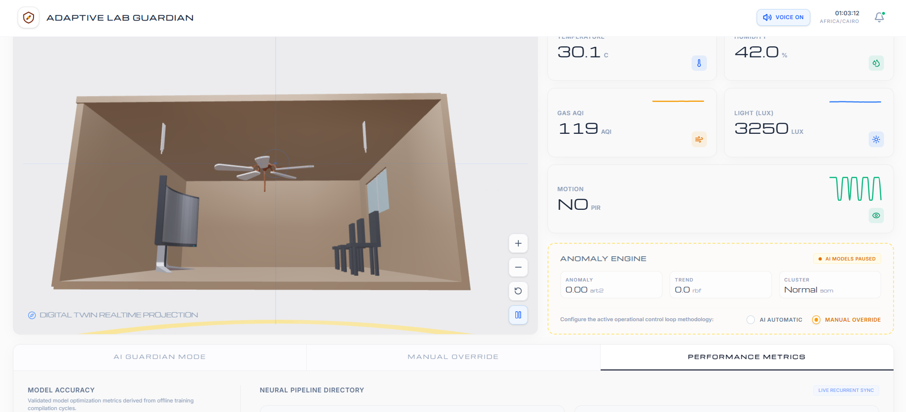
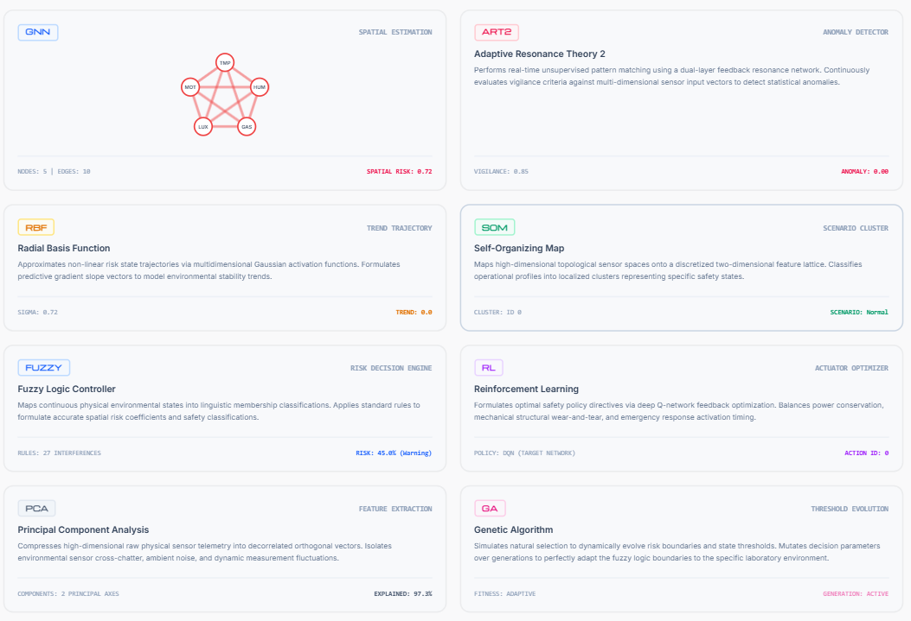
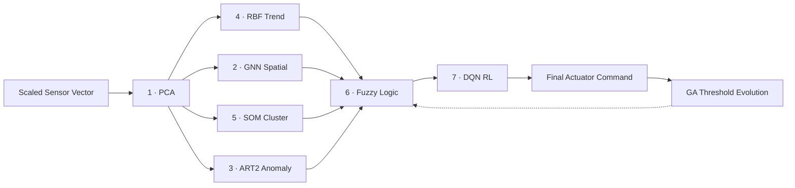
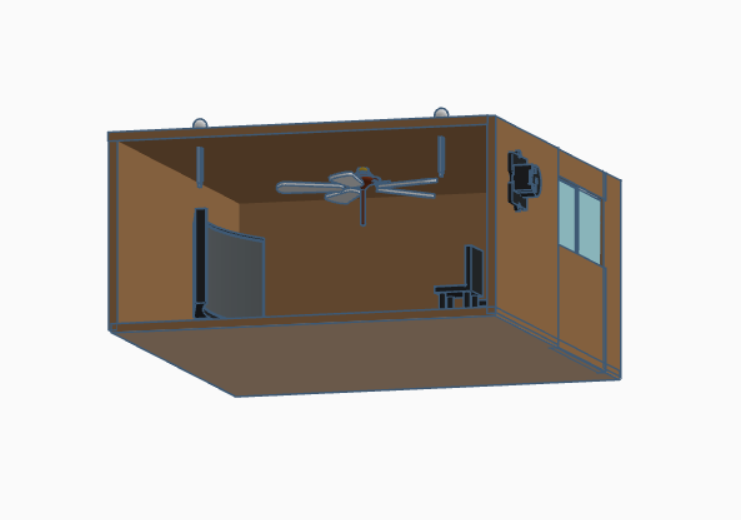
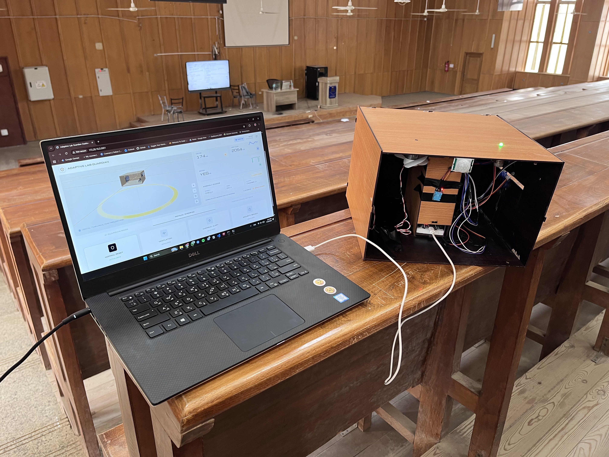

<div align="center">

# 🛡️ Adaptive Lab Guardian (ALG)

### When 7 AI Models Team Up to Protect a Laboratory — Even When No One Is Watching.

[](.)
[](.)
[](.)
[](.)
[](.)

<br/>



<sub><i>Real-time dashboard with live sensor telemetry, 3D Digital Twin, and AI-powered anomaly detection.</i></sub>

</div>

---

## 📋 Table of Contents

- [Overview](#-overview)
- [The Problem](#-the-problem)
- [System Architecture](#-system-architecture)
- [The 7 AI Models](#-the-7-ai-models--evolution-layer)
- [Dashboard & Features](#-dashboard--features)
- [Hardware Setup](#-hardware-setup-esp32)
- [Quick Start](#-quick-start)
- [Performance Metrics](#-performance-metrics)
- [Live Demo](#-live-demo)

---

## 🔍 Overview

**Adaptive Lab Guardian (ALG-1)** is a full-stack **AIoT** platform for protecting high-risk laboratory environments. It combines an **ESP32** edge node, a real-time **7-model AI pipeline**, and a modern web dashboard with a 3D digital twin.

Rather than waiting for human intervention after a gas leak, temperature spike, or security breach, the system fuses all sensor signals, decides in **milliseconds**, drives actuators (fan, alarm, window, lighting), and learns from outcomes to improve future responses.

| Layer | Role |
|-------|------|
| **Edge (ESP32)** | Captures 5 environmental variables every 5 seconds and drives actuators |
| **AI Brain (Python)** | Runs PCA → GNN / SOM / RBF / ART2 → Fuzzy → RL in milliseconds |
| **Dashboard (React)** | Live telemetry, 3D digital twin, manual override, training metrics |

---

## ⚠️ The Problem

University and industrial laboratories face risks that begin as **small, almost unnoticed changes**:

| Risk | Why It Matters |
|------|----------------|
| 🧪 Chemical gas leakage | Invisible, fast-spreading, life-threatening |
| 🌡️ Equipment overheating | Thermal runaway can damage assets and trigger fires |
| 🚨 Unauthorized access | Security breaches in restricted zones |
| ⏱️ Delayed human response | Traditional alarms wait for someone to notice and react |

> **Traditional systems wait for humans to react. ALG-1 does not wait.**

---

## 🏗️ System Architecture


### The 5-Stage Control Loop

```
  ① Sense  →  ② Analyze  →  ③ Decide  →  ④ Act  →  ⑤ Learn
     ESP32       PCA+GNN       Fuzzy        Actuators    DQN+GA
                 SOM+RBF       27 rules     milliseconds policy
                 ART2                                    evolves
```

---

## 🤖 The 7 AI Models + Evolution Layer

<div align="center">


<sub><i>Neural Pipeline Directory — real-time status of all 7 AI models and the Genetic Algorithm evolution layer.</i></sub>
</div>

<br/>



| # | Model | Purpose | Key Metric |
|:-:|-------|---------|:----------:|
| 1 | **PCA** | Dimensionality reduction & noise filtration | 97.31% variance retained |
| 2 | **GNN (GAT)** | Graph Attention — spatial sensor relationships | 20 attention edges |
| 3 | **ART2** | Unsupervised novelty & anomaly detection | 5 learned categories |
| 4 | **RBF** | Radial Basis — temporal trend & velocity prediction | σ = 0.985, 8 centers |
| 5 | **SOM** | Self-Organizing Map — state clustering | 4 cluster profiles |
| 6 | **Fuzzy Logic** | Multi-signal fusion via 27 safety rules | 93.9% precision |
| 7 | **DQN RL** | Q-learning actuator policy refinement | 98.4% success rate |
| + | **Genetic Algorithm** | Offline threshold optimization for fuzzy boundaries | GA-tuned thresholds |

---

## 🖥️ Dashboard & Features

<div align="center">


<sub><i>3D WebGL Digital Twin — real-time synchronized lab visualization with animated actuators.</i></sub>
</div>

<br/>

The dashboard provides three interactive views:

| Tab | Features |
|-----|----------|
| **🛡️ Guardian** | Live sensor cards, sparkline charts, Dynamic Island status HUD, 3D digital twin |
| **🎛️ Manual** | Per-actuator toggles, mode selection (Routine / Ventilation / Chemical / Security) |
| **📊 Metrics** | Training accuracy rings, model topology, validation matrices |

### Key Interactive Features

- **Dynamic Island HUD** — Context-aware status pill: green `SYSTEM SECURE` → amber warnings → crimson breach alerts
- **3D WebGL Digital Twin** — Three.js lab viewer with animated fans, shifting spotlights, and emergency strobes synchronized to live state
- **Voice Assistant** — Browser `speechSynthesis` announces risk transitions in real-time
- **Dual Control Mode** — Seamless switching between AI Automatic and Manual Override

### Lab Operational States

| State | Signature | Dashboard Status |
|-------|-----------|:----------------:|
| **Normal / Stable** | Low gas, low motion, nominal light | 🟢 `SYSTEM SECURE` |
| **Crowded / Thermal** | Elevated temp (32–40 °C), high light | 🟡 `WARNING` |
| **Chemical Hazard** | Gas AQI > 70, high temp | 🔴 `CHEMICAL HAZARD` |
| **Security Breach** | Dark environment, PIR triggered | 🔴 `SECURITY BREACH` |

### Response Matrix

| Mode | Fan | Alarm | Window | Buzzer | LED |
|------|:---:|:-----:|:------:|:------:|:---:|
| Normal | OFF | OFF | CLOSED | OFF | 🟢 Green |
| Ventilation | ON | OFF | CLOSED | OFF | 🟡 Yellow |
| Chemical Alert | ON | ON | OPEN | ON | 🔴 Red |
| Security Breach | OFF | ON | CLOSED | ON | 🔴 Red |

---

## 🔧 Hardware Setup (ESP32)

<div align="center">



<sub><i>Real project hardware — ESP32 edge node with DHT11, MQ135, PIR, LDR sensors and fan, buzzer, servo, RGB LED actuators.</i></sub>

</div>

### Sensors

| Sensor | Component | ESP32 Pin |
|--------|-----------|:---------:|
| Temperature & Humidity | DHT11 | `14` |
| Motion Detection | PIR | `34` (input-only) |
| Gas / Air Quality | MQ135 via ADS1115 | I²C `SDA 21` / `SCL 22` |
| Ambient Light | LDR via ADS1115 | I²C `SDA 21` / `SCL 22` |

### Actuators

| Actuator | Component | ESP32 Pin |
|----------|-----------|:---------:|
| Ventilation Fan | Relay / motor driver | `33` |
| Audible Alarm | Buzzer | `23` |
| Window / Gate | Servo motor | `19` |
| Status LED | RGB LED | R:`25` G:`26` B:`27` |

---

## 🚀 Quick Start

### Prerequisites

| Requirement | Version |
|-------------|:-------:|
| Python | 3.10+ |
| Node.js | 18+ |
| MQTT Broker (Mosquitto) | any |
| Arduino IDE (for ESP32) | 2.x |

### 1 — Clone & Install

```bash
git clone <repository-url>
cd Adaptive_Lab_Guardian

pip install -r requirements.txt

# Optional: enable full GAT GNN
pip install torch torch-geometric
```

### 2 — Configure Environment

Create `dashboard/.env`:

```env
ALG_MQTT_BROKER=127.0.0.1
ALG_MQTT_PORT=1883
ALG_SENSOR_TOPIC=alg1/sensors
ALG_ACTION_TOPIC=alg1/actions
ALG_MODE_TOPIC=alg1/mode
ALG_DASHBOARD_PORT=8765
ALG_PURE_IOT=false
VITE_DASHBOARD_API_URL=http://localhost:8765
```

### 3 — Start MQTT Broker

```bash
# Windows
net start mosquitto

# Linux / macOS
mosquitto -v
```

### 4 — Launch the Full Stack

```bash
cd dashboard
npm install
npm run dev:all
```

This starts three concurrent processes:

| Process | Port | Role |
|---------|:----:|------|
| `server.mjs` | 8765 | API bridge + MQTT + SSE |
| Vite dev server | 3000 | React dashboard UI |
| `ai/mqtt_client.py` | — | Python AI pipeline |

Open the dashboard: **http://localhost:3000**

### 5 — Flash the ESP32

1. Open `esp32/esp32_mqtt.ino` in Arduino IDE
2. Set WiFi credentials and MQTT broker IP
3. Select your ESP32 board and COM port
4. Upload

---

## 📊 Performance Metrics

> Trained on **8,064** samples, tested on **2,016** held-out temporal samples.

| Metric | Value |
|--------|:-----:|
| Risk Classifier Accuracy | **86.16%** |
| Scenario Recall | **86.21%** |
| PCA Variance Coverage | **97.31%** |
| Fuzzy Inference Precision | **93.9%** |
| DQN RL Policy Success | **98.4%** |
| False Alert Rate | 6.1% |
| Warning Miss Rate | **0.15%** |

---

## 🎬 Live Demo

Real project photos and the working hardware demo are hosted on Google Drive:

### **[📂 Open Drive Folder — Images & Live Demo](https://drive.google.com/drive/folders/1O4-FP51uECPyOTMI60t2VOj0jUc10Ayb?usp=sharing)**

| Content | Description |
|---------|-------------|
| 📸 **Images** | Comprehensive shots of the fully integrated project during operation |
| 🎥 **Live Demo** | Hardware demo video + Dashboard UI & analytics walkthrough |

---

## 🛠️ Technology Stack

| Component | Technologies |
|-----------|-------------|
| Edge firmware | ESP32, Arduino, DHT11, MQ135, ADS1115, PIR, Servo, PubSubClient |
| AI runtime | Python 3.10+, NumPy, scikit-learn, scikit-fuzzy, minisom, paho-mqtt |
| Deep learning | PyTorch, PyTorch Geometric (GAT model) |
| Dashboard backend | Node.js, native HTTP, MQTT client, Server-Sent Events |
| Dashboard frontend | React 19, TypeScript, Vite, Tailwind CSS, Recharts, Three.js / R3F |
| Messaging | MQTT (Mosquitto) |
| Dataset | 10,080 labelled rows — 5 features, 4 scenario classes |

---

## 📁 Project Structure

```
Adaptive_Lab_Guardian/
├── ai/                      # 🧠 AI pipeline (Python)
│   ├── main.py              # Runtime entry — full 7-model pipeline
│   ├── mqtt_client.py       # MQTT bridge: sensors in, actions out
│   ├── pca.py               # PCA noise filter
│   ├── gnn.py               # GAT spatial attention model
│   ├── art2.py              # ART2 anomaly detector
│   ├── rbf.py               # RBF temporal trend network
│   ├── som.py               # SOM cluster mapper
│   ├── fuzzy.py             # Fuzzy decision engine (27 rules)
│   ├── rl.py                # DQN actuator optimizer
│   ├── ga.py                # Genetic algorithm threshold tuner
│   └── models/              # Trained artifacts (gitignored)
│
├── dashboard/               # 🖥️ React + Vite frontend + API bridge
│   ├── server.mjs           # Node.js SSE & MQTT bridge
│   ├── src/
│   │   ├── components/
│   │   │   ├── Dashboard.tsx
│   │   │   └── Lab3DModel.tsx
│   │   └── lib/guardianData.ts
│   └── package.json
│
├── data/                    # 📊 Dataset & runtime logs
│   └── Adaptive_Lab_Guardian.csv
│
├── esp32/                   # 🔌 ESP32 firmware
│   └── esp32_mqtt.ino
│
├── docs/                    # 📄 Documentation & media
│   ├── screenshots/         # Dashboard & UI screenshots
│   ├── real-hardware/       # Real project hardware photos
│   └── Presentation/        # Project presentation (.pptx)
│
├── requirements.txt
└── README.md
```

---

<div align="center">

**ALG-1** — Built to protect what matters when no one is watching. 🥼

[📂 Live Demo](https://drive.google.com/drive/folders/1O4-FP51uECPyOTMI60t2VOj0jUc10Ayb?usp=sharing) · [⬆ Back to top](#️-adaptive-lab-guardian-alg-1)

</div>
