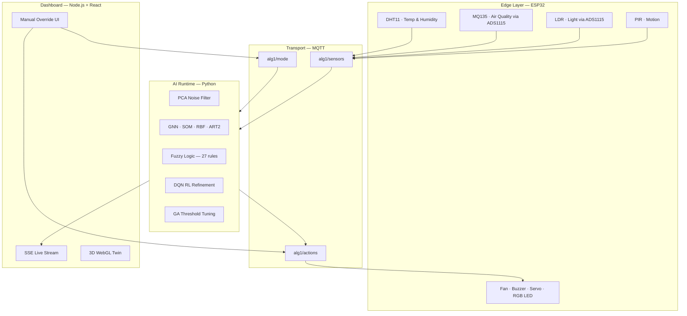
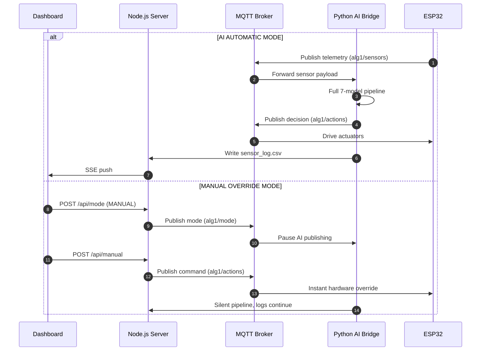
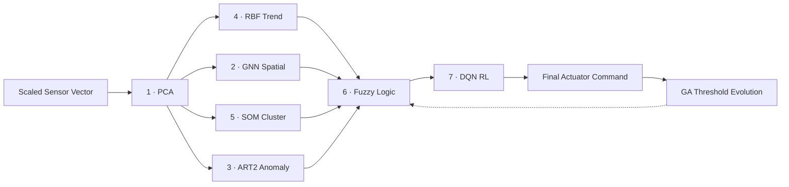

<div align="center">

# Adaptive Lab Guardian (ALG-1)

**When 7 AI models team up to protect a laboratory — even when no one is watching.**

[](.)
[](.)
[](.)
[](.)
[](.)

</div>

---

## Overview

**Adaptive Lab Guardian (ALG-1)** is a full-stack **AIoT** platform for protecting high-risk laboratory environments. It combines an **ESP32** edge node, a real-time **7-model AI pipeline**, and a modern web dashboard with a 3D digital twin.

Rather than waiting for human intervention after a gas leak, temperature spike, or security breach, the system fuses all sensor signals, decides in **milliseconds**, drives actuators (fan, alarm, window, lighting), and learns from outcomes to improve future responses.

---

## Live Demo & Real Hardware

Real project photos and the working hardware demo are hosted on Google Drive:

**[Open Drive folder — Images & Live Demo](https://drive.google.com/drive/folders/1O4-FP51uECPyOTMI60t2VOj0jUc10Ayb?usp=sharing)**

| Content | Drive folder | What it shows |
|---------|--------------|---------------|
| **Images** | `Images/` | Physical ESP32 setup, sensors, wiring, and lab prototype |
| **Live Demo** | `Live Demo/` | Full system running — telemetry, AI decisions, and actuator response |

The hardware video captures the **edge layer** (sensors → MQTT → fan, buzzer, servo, LEDs). The **dashboard voice assistant** runs in the browser and is easy to miss in a camera-only recording — see [Voice Assistant](#voice-assistant) below for how to present it.

---

## Table of Contents

- [Overview](#overview)
- [Live Demo & Real Hardware](#live-demo--real-hardware)
- [The Problem](#the-problem)
- [What is ALG?](#what-is-alg)
- [System Architecture](#system-architecture)
- [The 5-Stage Control Loop](#the-5-stage-control-loop)
- [The 7 AI Models + Evolution Layer](#the-7-ai-models--evolution-layer)
- [Lab Operational States](#lab-operational-states)
- [Response Matrix](#response-matrix)
- [Technology Stack](#technology-stack)
- [Project Structure](#project-structure)
- [Hardware Setup (ESP32)](#hardware-setup-esp32)
- [MQTT Data Contract](#mqtt-data-contract)
- [Dashboard & API](#dashboard--api)
- [Quick Start](#quick-start)
- [Configuration Reference](#configuration-reference)
- [Training & Model Artifacts](#training--model-artifacts)
- [Performance Metrics](#performance-metrics)
- [Lessons Learned](#lessons-learned)
- [Troubleshooting](#troubleshooting)

---

## The Problem

University and industrial laboratories face risks that often begin as **small, almost unnoticed changes**:

| Risk | Why it matters |
|------|----------------|
| Chemical gas leakage | Invisible, fast-spreading, life-threatening |
| Equipment overheating | Thermal runaway can damage assets and trigger fires |
| Unauthorized access | Security breaches in restricted zones |
| Delayed human response | Traditional alarms wait for someone to notice and react |

> **Traditional systems wait for humans to react. ALG-1 does not wait.**

A slight temperature rise, a minor air-quality fluctuation, and unexpected motion at an unusual hour may each seem insignificant alone — but together they can signal the start of a real incident. ALG-1 fuses all signals, classifies the situation, and acts in real time.

---

## What is ALG?

**Adaptive Lab Guardian** is a smart laboratory safety system where multiple AI models collaborate to **interpret** what is happening and **respond** accordingly.

Instead of merely monitoring sensor values, ALG-1 tries to **understand** the laboratory as a dynamic environment that shifts between operational realities:

```text
Normal / Stable  →  Crowded / Thermal  →  Chemical Hazard  →  Security Breach
```

The platform spans three layers:

| Layer | Role |
|-------|------|
| **Edge (ESP32)** | Captures 5 environmental variables every 5 seconds and drives actuators |
| **AI Brain (Python)** | Runs PCA → GNN / SOM / RBF / ART2 → Fuzzy → RL in milliseconds |
| **Dashboard (React)** | Live telemetry, 3D digital twin, manual override, training metrics |

---

## System Architecture



### Dual Control Mode



---

## The 5-Stage Control Loop

| Stage | Name | What happens |
|:-----:|------|--------------|
| **01** | **Sense** | ESP32 collects 5 variables continuously and publishes via MQTT |
| **02** | **Analyze** | PCA filters noise; GNN, SOM, RBF, and ART2 extract patterns and anomalies |
| **03** | **Decide** | Fuzzy Logic fuses all signals via 27 rules → risk score + baseline action |
| **04** | **Act** | RL refines the decision; actuators respond in milliseconds |
| **05** | **Learn** | DQN updates policy; Genetic Algorithm tunes thresholds from feedback |

```text
FROM RAW SENSORS → SMART DECISIONS → REAL-TIME ACTION → CONTINUOUS IMPROVEMENT
```

---

## The 7 AI Models + Evolution Layer



| # | Model | File | Function | Key Metric |
|:-:|-------|------|----------|:----------:|
| 1 | **PCA** | `ai/pca.py` | Dimensionality reduction & noise filtration | 97.31% variance retained |
| 2 | **GNN** | `ai/gnn.py` | Graph Attention Network — spatial sensor relationships | 20 attention edges |
| 3 | **ART2** | `ai/art2.py` | Unsupervised vigilance-based novelty detection | 5 learned categories |
| 4 | **RBF** | `ai/rbf.py` | Radial Basis temporal trend & velocity prediction | σ = 0.985, 8 centers |
| 5 | **SOM** | `ai/som.py` | Self-Organizing Map — topological state clustering | 4 cluster profiles |
| 6 | **Fuzzy Logic** | `ai/fuzzy.py` | Multi-signal fusion via 27 if-then safety rules | 93.9% precision |
| 7 | **DQN RL** | `ai/rl.py` | Q-learning actuator policy refinement | 98.4% success rate |
| + | **Genetic Algorithm** | `ai/ga.py` | Offline threshold optimization for fuzzy boundaries | GA-tuned thresholds |

### Model Details

**PCA** — Projects the 5-dimensional vector *(Temp, Humidity, Gas, Light, Motion)* into a clean feature space, removing electrical noise and sensor drift before any downstream model processes the data.

**GNN (GAT)** — Treats each sensor channel as a graph node. Graph Attention convolutions model how hazards (e.g. gas diffusion) may propagate spatially across the lab.

**ART2** — Unsupervised adaptive resonance theory. Raises an alert when an environmental signature was absent from the training corpus.

**RBF** — Monitors the velocity of change across time steps. Distinguishes slow environmental drift from rapid catastrophic spikes.

**SOM** — Organizes sensor states into 4 discrete operational clusters (see [Lab Operational States](#lab-operational-states)).

**Fuzzy Logic** — Aggregates PCA, GNN, SOM, RBF, and ART2 outputs through **27 fuzzy rules**, producing a continuous **0–100% risk score** and a baseline actuator command set.

**DQN RL** — Refines the fuzzy baseline using a learned Q-table. Reduces actuator chatter and minimizes unnecessary energy consumption through reward shaping.

**Genetic Algorithm** — Evolves warning/danger thresholds (`gas_warning`, `temp_warning`, etc.) from labelled historical data, balancing sensitivity against false alarms.

---

## Lab Operational States

The SOM and fuzzy engine classify the laboratory into four scenario clusters:

| ID | State | Typical Signature | Dashboard Label |
|:--:|-------|-------------------|-----------------|
| `0` | **Normal / Stable** | Low gas, low motion, nominal light | `SYSTEM SECURE` |
| `1` | **Crowded / Thermal** | Elevated temperature (32–40 °C), high light | `WARNING` |
| `2` | **Chemical Hazard** | Gas AQI > 70, high temp, elevated light | `CHEMICAL HAZARD` |
| `3` | **Security Breach** | Dark environment, low temp, PIR triggered | `SECURITY BREACH` |

Risk levels map to three actionable tiers: **Normal → Warning → Critical**.

---

## Response Matrix

From decision to hardware action in milliseconds:

| `action_id` | Mode | Fan | Alarm | Window (Servo) | Buzzer | RGB LED |
|:-----------:|------|:---:|:-----:|:--------------:|:------:|:-------:|
| `0` | Routine / Normal | OFF | OFF | CLOSED | OFF | Green |
| `1` | Ventilation / Crowded | ON | OFF | CLOSED | OFF | Yellow |
| `2` | Chemical Alert | ON | ON | OPEN | ON | Red |
| `3` | Security Breach | OFF | ON | CLOSED | ON | Red |

---

## Technology Stack

| Component | Technologies |
|-----------|-------------|
| Edge firmware | ESP32, Arduino, DHT11, MQ135, ADS1115, PIR, Servo, PubSubClient |
| AI runtime | Python 3.10+, NumPy, scikit-learn, scikit-fuzzy, minisom, paho-mqtt |
| Deep learning (optional) | PyTorch, PyTorch Geometric (GAT model) |
| Dashboard backend | Node.js, native HTTP, MQTT client, Server-Sent Events |
| Dashboard frontend | React 19, TypeScript, Vite, Tailwind CSS, Recharts, Three.js / React Three Fiber |
| Messaging | MQTT (Mosquitto or any compatible broker) |
| Dataset | 10,080 labelled rows in `data/Adaptive_Lab_Guardian.csv` |

---

## Project Structure

```text
Adaptive_Lab_Guardian/
│
├── ai/                              # AI pipeline (Python)
│   ├── main.py                      # Runtime entry — full 7-model pipeline
│   ├── mqtt_client.py               # MQTT bridge: sensors in, actions out
│   ├── preprocessing.py             # Dataset loading, SMOTE, scaling
│   ├── pca.py                       # PCA noise filter
│   ├── gnn.py                       # GAT spatial attention model
│   ├── art2.py                      # ART2 anomaly detector
│   ├── rbf.py                       # RBF temporal trend network
│   ├── som.py                       # SOM cluster mapper
│   ├── fuzzy.py                     # Fuzzy decision engine (27 rules)
│   ├── rl.py                        # DQN actuator optimizer
│   ├── ga.py                        # Genetic algorithm threshold tuner
│   └── models/                      # Trained artifacts (gitignored)
│       ├── scaler.pkl, pca.pkl, art2.pkl, rbf.pkl
│       ├── risk_guard.pkl, som.pkl, gnn.pkl / gnn.pth
│       ├── gnn_attention.npy, rl_qtable.npy, ga_policy.npy
│       └── train_report.json
│
├── dashboard/                       # React + Vite frontend + API bridge
│   ├── server.mjs                   # Node.js SSE & MQTT bridge (port 8765)
│   ├── scripts/dev-all.mjs          # Launches API + Vite + AI bridge together
│   ├── package.json
│   └── src/
│       ├── components/
│       │   ├── Dashboard.tsx        # Main UI: charts, controls, metrics
│       │   └── Lab3DModel.tsx       # WebGL 3D digital twin
│       └── lib/guardianData.ts      # SSE telemetry hook
│
├── data/
│   ├── Adaptive_Lab_Guardian.csv    # Historical training dataset (10,080 rows)
│   ├── sensor_log.csv               # Live log written by the AI bridge
│   └── control_state.json           # Persistent AI / Manual mode state
│
├── docs/
│   └── Live Demo/                   # Optional local demo backup
│
├── esp32/
│   └── esp32_mqtt.ino               # ESP32 firmware: sensors, MQTT, actuators
│
├── requirements.txt
├── .gitignore
└── README.md
```

---

## Hardware Setup (ESP32)

### Sensors

| Sensor | Component | ESP32 Pin | Notes |
|--------|-----------|:---------:|-------|
| Temperature & Humidity | DHT11 | `14` | Digital one-wire |
| Motion Detection | PIR | `34` | Input-only pin |
| Gas / Air Quality | MQ135 via ADS1115 | I²C `SDA 21` / `SCL 22` | 16-bit ADC |
| Ambient Light | LDR via ADS1115 | I²C `SDA 21` / `SCL 22` | Shared I²C bus |

### Actuators

| Actuator | Component | ESP32 Pin |
|----------|-----------|:---------:|
| Ventilation Fan | Relay / motor driver | `33` |
| Audible Alarm | Buzzer | `23` |
| Window / Gate | Servo motor | `19` |
| Status LED | RGB LED | R:`25` G:`26` B:`27` |

### Firmware Configuration

Open `esp32/esp32_mqtt.ino` in the **Arduino IDE** and update:

```cpp
const char* ssid        = "YOUR_WIFI_SSID";
const char* password    = "YOUR_WIFI_PASSWORD";
const char* mqtt_server = "YOUR_MQTT_BROKER_IP";  // Must match ALG_MQTT_BROKER
```

**Required Arduino libraries:** `WiFi`, `PubSubClient`, `Wire`, `Adafruit_ADS1X15`, `DHT sensor library`, `ESP32Servo`.

> PIN 34 on the ESP32 is **input-only** — suitable for the PIR signal line. Do not use it as an output.

### Edge Processing

The firmware applies an **EMA filter** (α = 0.15) to gas and light readings, publishes telemetry every **5 seconds**, and debounces repeated actuator commands with a **5-second** window.

---

## MQTT Data Contract

### Topics

| Topic | Direction | Purpose |
|-------|-----------|---------|
| `alg1/sensors` | ESP32 → Cloud | Environmental telemetry |
| `alg1/actions` | Cloud → ESP32 | Actuator commands |
| `alg1/mode` | Dashboard → AI Bridge | `AI` or `MANUAL` system mode |

### Sensor Payload — `alg1/sensors`

```json
{
  "Timestamp": "2026-05-18 14:15:00",
  "Temp_C": 24.2,
  "Humidity_pct": 55.0,
  "Gas_AQI": 70.0,
  "Light_Lux": 1200.0,
  "Motion_Detected": 0
}
```

### Actuator Payload — `alg1/actions`

```json
{
  "fan": "OFF",
  "alarm": "OFF",
  "servo": "CLOSED",
  "buzzer": "OFF",
  "rgb_led": "GREEN",
  "action_id": 0
}
```

### Mode Payload — `alg1/mode`

```json
{
  "system_mode": "AI"
}
```

Valid modes: `AI` (automatic pipeline publishes actions) · `MANUAL` (dashboard/operator controls actuators).

---

## Dashboard & API

The dashboard provides three views:

| Tab | Features |
|-----|----------|
| **Guardian** | Live sensor cards, sparkline charts, Dynamic Island status HUD, 3D digital twin |
| **Manual** | Per-actuator toggles, mode selection (Routine / Ventilation / Chemical / Security) |
| **Metrics** | Training accuracy rings, model topology, validation matrices from `train_report.json` |

### Interactive Safety Features

- **Dynamic Island HUD** — Context-aware status pill: green `SYSTEM SECURE` → amber warnings → crimson breach alerts
- **3D WebGL Digital Twin** — Three.js lab viewer with animated fans, shifting spotlights, and emergency strobes synchronized to live state
- **Voice Assistant** — Browser `speechSynthesis` announces risk transitions (dashboard-only; see below)

### Voice Assistant

The voice assistant is a **dashboard feature**, not hardware audio. It uses the browser [Web Speech API](https://developer.mozilla.org/en-US/docs/Web/API/SpeechSynthesis) (`window.speechSynthesis`) and triggers when risk state, scenario, or cluster changes. A camera pointed at the ESP32 board will not capture it.

**Toggle:** Speaker icon in the dashboard header (enabled by default).

| Trigger | Spoken announcement |
|---------|---------------------|
| Voice re-enabled | *"Voice assistant calibrated. Guardian protocol active."* |
| Critical / anomaly / Dangerous | *"Alert! Critical hazard detected. [Scenario]. System is in dangerous anomaly state. Initiating automatic cooling and alarms immediately."* |
| Warning | *"Warning. Elevated risk detected. [Scenario]. Engaging mitigation directives."* |
| Return to nominal | *"Environmental parameters stabilized. Guardian loop returned to nominal flow."* |
| Cluster transition | *"System transitioned to active cluster: [Scenario]."* |

### REST & SSE Endpoints

Base URL: `http://localhost:8765` (configurable via `ALG_DASHBOARD_PORT`)

| Method | Endpoint | Description |
|--------|----------|-------------|
| `GET` | `/api/health` | Broker connectivity and system health |
| `GET` | `/api/state` | Full dashboard state snapshot |
| `GET` | `/api/events` | Server-Sent Events live stream |
| `POST` | `/api/mode` | Set `AI` or `MANUAL` control mode |
| `POST` | `/api/manual` | Publish manual actuator override |
| `POST` | `/api/refresh` | Force reload state from CSV log |

---

## Quick Start

### Prerequisites

| Requirement | Version |
|-------------|:-------:|
| Python | 3.10+ |
| Node.js | 18+ |
| npm | 9+ |
| Mosquitto (or any MQTT broker) | any |
| Arduino IDE (for ESP32) | 2.x |

### 1 — Clone & Install

```bash
git clone <repository-url>
cd Adaptive_Lab_Guardian

pip install -r requirements.txt

# Optional: enable full GAT GNN at runtime
pip install torch torch-geometric
```

### 2 — Configure Environment

Create `dashboard/.env`:

```env
ALG_MQTT_BROKER=127.0.0.1
ALG_MQTT_PORT=1883
ALG_SENSOR_TOPIC=alg1/sensors
ALG_ACTION_TOPIC=alg1/actions
ALG_MODE_TOPIC=alg1/mode
ALG_DASHBOARD_PORT=8765
ALG_PURE_IOT=false
VITE_DASHBOARD_API_URL=http://localhost:8765
```

| Variable | Description |
|----------|-------------|
| `ALG_PURE_IOT=false` | Load the full PyTorch GNN/SOM pipeline (recommended) |
| `ALG_PURE_IOT=true` | IoT bridge only — skips AI inference |
| `ALG_SYSTEM_MODE` | Default mode on boot: `AI` or `MANUAL` (default: `MANUAL`) |

### 3 — Ensure Model Artifacts Exist

Trained model files live in `ai/models/` and are **not committed** to the repository. You must either:

- Run the local training script (see [Training & Model Artifacts](#training--model-artifacts)), or
- Obtain pre-trained artifacts from the project maintainer.

Without artifacts, the pipeline falls back to heuristic rules but remains functional.

### 4 — Start MQTT Broker

```bash
# Windows (if Mosquitto is installed as a service)
net start mosquitto

# Linux / macOS
mosquitto -v
```

### 5 — Launch the Full Stack

```bash
cd dashboard
npm install
npm run dev:all
```

This starts three processes concurrently:

| Process | Port | Role |
|---------|:----:|------|
| `server.mjs` | 8765 | API bridge + MQTT subscriber + SSE |
| Vite dev server | 3000 | React dashboard UI |
| `ai/mqtt_client.py` | — | Python AI pipeline + MQTT publisher |

Open the dashboard: **[http://localhost:3000](http://localhost:3000)**

### 6 — Flash the ESP32

1. Open `esp32/esp32_mqtt.ino` in Arduino IDE
2. Set WiFi credentials and MQTT broker IP
3. Select your ESP32 board and COM port
4. Upload

### 7 — Switch to AI Mode

From the dashboard **Manual** tab, toggle system mode to **AI**, or:

```bash
curl -X POST http://localhost:8765/api/mode \
  -H "Content-Type: application/json" \
  -d '{"mode":"AI"}'
```

---

## Configuration Reference

### Python AI Bridge (`ai/mqtt_client.py`)

| Variable | Default | Description |
|----------|---------|-------------|
| `ALG_MQTT_BROKER` | `127.0.0.1` | MQTT broker hostname |
| `ALG_MQTT_PORT` | `1883` | MQTT broker port |
| `ALG_SENSOR_TOPIC` | `alg1/sensors` | Subscribe topic |
| `ALG_ACTION_TOPIC` | `alg1/actions` | Publish topic |
| `ALG_MODE_TOPIC` | `alg1/mode` | Control mode topic |
| `ALG_PURE_IOT` | `false` | Skip AI inference when `true` |
| `ALG_SYSTEM_MODE` | `MANUAL` | Boot control mode |

Environment files are loaded from `dashboard/.env` or project root `.env`.

### Dashboard API (`dashboard/server.mjs`)

| Variable | Default | Description |
|----------|---------|-------------|
| `ALG_DASHBOARD_PORT` | `8765` | API server port |
| `ALG_DASHBOARD_HISTORY` | `80` | Max history points in SSE stream |
| `ALG_MQTT_RECONNECT_MS` | `5000` | MQTT reconnect interval |
| `ALG_MQTT_USERNAME` | — | Optional broker auth |
| `ALG_MQTT_PASSWORD` | — | Optional broker auth |

---

## Training & Model Artifacts

The training script `ai/train_models.py` generates all model artifacts and `train_report.json`. It is kept locally (gitignored) alongside the trained weights.

```bash
python -m ai.train_models
```

### Dataset

| Property | Value |
|----------|-------|
| File | `data/Adaptive_Lab_Guardian.csv` |
| Rows | 10,080 |
| Features | `Temp_C`, `Humidity_pct`, `Gas_AQI`, `Light_Lux`, `Motion_Detected` |
| Labels | `True_Scenario` (1=Normal, 2=Chemical, 3=Crowded, 4=Security) |
| Train / Test split | 8,064 / 2,016 (temporal hold-out) |
| Balancing | SMOTE oversampling for minority classes |

### Class Balancing (SMOTE)

| Type | Class | Label | Before | After |
|------|:-----:|-------|:------:|:-----:|
| Risk | `0` | Safe | 3,458 | 3,458 |
| Risk | `1` | Warning | 3,071 | **3,458** |
| Risk | `2` | Critical | 1,535 | **3,458** |
| Scenario | `0` | Normal | 3,458 | 3,458 |
| Scenario | `1` | Crowded | 3,071 | **3,458** |
| Scenario | `2` | Chemical | 958 | **3,458** |
| Scenario | `3` | Security | 577 | **3,458** |

### Generated Artifacts

```text
ai/models/
├── scaler.pkl          # Feature scaler
├── pca.pkl             # PCA transformer
├── art2.pkl            # ART2 network
├── rbf.pkl             # RBF trend model
├── som.pkl             # SOM cluster map
├── gnn.pkl / gnn.pth   # GNN profile + weights
├── risk_guard.pkl      # Supervised risk guardrail
├── gnn_attention.npy   # Saved attention edges
├── rl_qtable.npy       # RL Q-table
├── ga_policy.npy       # GA-tuned thresholds
└── train_report.json   # Validation metrics for dashboard
```

---

## Performance Metrics

> Source: `ai/models/train_report.json` — trained on **8,064** samples, tested on **2,016** held-out temporal samples.

### Accuracy Summary

| Metric | Value |
|--------|:-----:|
| Risk Classifier Accuracy | **86.16%** |
| Scenario Recall | **86.21%** |
| PCA Variance Coverage | **97.31%** |
| Fuzzy Inference Precision | **93.9%** |
| DQN RL Policy Success | **98.4%** |
| False Alert Rate | 6.1% |
| Warning Miss Rate | **0.15%** |

### GA-Tuned Safety Thresholds

| Parameter | Threshold |
|-----------|:---------:|
| `gas_warning` | 44.52% |
| `temp_warning` | 61.21% |
| `gas_danger` | 76.80% |
| `temp_danger` | 98.00% |

---

## Lessons Learned

Building a real-time 7-model AIoT pipeline taught us:

1. **Real data first** — We ran sensors live in the lab to capture real-world ranges, then generated a realistic synthetic dataset in Python to train all models.
2. **Latency budget** — Running PCA, GNN, SOM, RBF, and ART2 in sequence, then Fuzzy Logic and RL, had to complete in **milliseconds**, not seconds. Each model's complexity was optimized for real-time inference.
3. **More models, more intelligence — more latency** — The trade-off between accuracy and response time required careful pipeline design.
4. **Fuzzy rule tuning** — Calibrating 27 fuzzy rules to minimize the 6.1% false alert rate took multiple training cycles.
5. **Balancing false alarms vs. missed warnings** — The 0.15% warning miss rate and GA-evolved thresholds reflect this ongoing optimization.

---

## Troubleshooting

| Symptom | Likely cause | Fix |
|---------|-------------|-----|
| Dashboard shows `booting` / no data | MQTT broker not running or wrong IP | Start Mosquitto; verify `ALG_MQTT_BROKER` matches broker IP |
| AI never publishes actions | System mode is `MANUAL` | Switch to `AI` mode from dashboard or `POST /api/mode` |
| ESP32 not connecting | WiFi credentials or broker IP mismatch | Update `ssid`, `password`, `mqtt_server` in `.ino` file |
| ADS1115 init failed | I²C wiring issue | Check SDA=`21`, SCL=`22`, 3.3V power |
| GNN loads fallback only | PyTorch not installed | `pip install torch torch-geometric` |
| Metrics tab empty | `train_report.json` missing | Run training script or add artifacts to `ai/models/` |
| Pure IoT mode active | `ALG_PURE_IOT=true` | Set `ALG_PURE_IOT=false` in `.env` |

### Verify Pipeline Locally

```bash
python -m ai.main
```

Runs four test sensor vectors through the full pipeline and prints human-readable decision reports.

### Verify MQTT Bridge

```bash
python -u ai/mqtt_client.py
```

Subscribes to `alg1/sensors`, runs inference, and publishes to `alg1/actions`.

---

## Acknowledgments

**ALG-1** combines edge hardware, real-time AI, and modern web technology into one intelligent safety system — built to protect what matters when no one is watching.

---

<div align="center">

**Explore the full architecture, source code, and [live demo on Google Drive](https://drive.google.com/drive/folders/1O4-FP51uECPyOTMI60t2VOj0jUc10Ayb?usp=sharing).**

*Protect your lab. 🥼*

</div>
