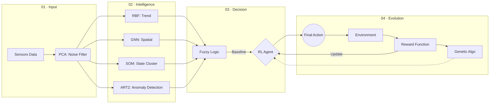
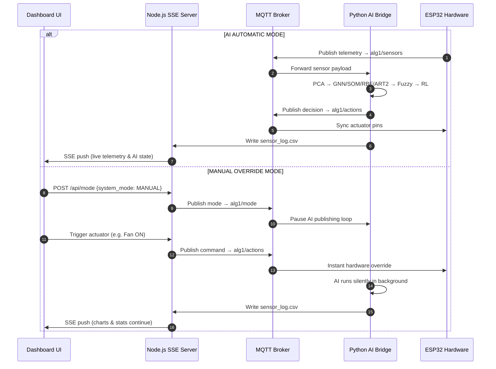

# 🛡️ Adaptive Lab Guardian (ALG)

[](https://reactjs.org/)
[](https://www.python.org/)
[](https://pytorch.org/)
[](https://mosquitto.org/)
[](https://www.arduino.cc/)
[](./LICENSE)

> An enterprise-grade, full-stack **AI + IoT** industrial safety platform that processes multi-spectral environmental telemetry from ESP32 edge nodes, runs it through a 7-model neural pipeline, and delivers millisecond-level automated actuator overrides to protect high-risk laboratory environments.

---

## 📋 Table of Contents

1. [Dashboard Showcase](#-enterprise-dashboard-showcase)
2. [Project File Structure](#-project-file-structure)
3. [Architecture Pipeline](#-architectural-intelligence-pipeline)
4. [The 7 AI Models](#-deep-dive-the-7-ai-models)
5. [Training & Validation Metrics](#-empirical-training--validation-metrics)
6. [Control-Loop Strategy](#-dual-control-loop-strategy)
7. [ESP32 Hardware Wiring](#-esp32-hardware-wiring)
8. [Quick Start Guide](#-quick-start--deployment-guide)
9. [Interactive Safety Features](#-interactive-safety-features)
10. [MQTT Data Contract](#-mqtt-data-contract)
11. [Offline Model Training](#-offline-model-training)

---

## 📸 Enterprise Dashboard Showcase

### 1. Primary Operation Center
Core dashboard interface with real-time WebGL canvas, system control toggles, and live log stream:

> 📷 **Screenshot** — Place `dashboard_overview.png` in `docs/screenshots/`


### 2. Neural Pipeline Performance Directory
Validation matrices, model topology structures, and training accuracy rings:

> 📷 **Screenshot** — Place `neural_pipeline_metrics.png` in `docs/screenshots/`


### 3. WebGL Digital Twin & Dynamic Island HUD
3D lab environment with the context-aware Dynamic Island status pill:

> 📷 **Screenshot** — Place `digital_twin_view.png` in `docs/screenshots/`


---

## 📁 Project File Structure

```text
adaptive_lab_guardian/
│
├── 📂 ai/                          # AI Pipeline (Python)
│   ├── main.py                     # Full 7-model runtime pipeline entry point
│   ├── train_models.py             # Training script — generates all model artifacts
│   ├── mqtt_client.py              # MQTT bridge: subscribes sensors, publishes actions
│   ├── preprocessing.py            # Dataset loading, SMOTE balancing, feature scaling
│   ├── pca.py                      # PCA noise filter
│   ├── art2.py                     # ART2 unsupervised anomaly detector
│   ├── rbf.py                      # RBF temporal trend network
│   ├── gnn.py                      # GNN spatial attention model (GAT)
│   ├── som.py                      # SOM self-organizing cluster mapper
│   ├── fuzzy.py                    # Fuzzy logic decision engine (27 rules)
│   ├── rl.py                       # RL DQN actuator optimizer
│   ├── ga.py                       # Genetic algorithm safety policy tuner
│   └── 📂 models/                  # Trained model artifacts — gitignored
│       ├── scaler.pkl / pca.pkl / art2.pkl / rbf.pkl
│       ├── risk_guard.pkl / som.pkl / gnn.pkl
│       ├── gnn_attention.npy / rl_qtable.npy / ga_policy.npy
│       └── train_report.json
│
├── 📂 dashboard/                   # React + Vite Frontend
│   ├── server.mjs                  # Node.js SSE & MQTT bridge (port 8765)
│   ├── package.json
│   ├── vite.config.ts
│   ├── .env                        # Local environment config — gitignored
│   └── 📂 src/
│       ├── main.tsx / App.tsx / index.css
│       └── 📂 components/
│           └── Dashboard.tsx       # Main UI: 3D twin, charts, actuator controls
│
├── 📂 data/                        # Datasets and live telemetry
│   ├── Adaptive_Lab_Guardian.csv   # Historical training dataset (10,080 rows)
│   ├── sensor_log.csv              # Live sensor log written by the AI bridge
│   └── control_state.json          # Persistent AI / Manual mode state
│
├── 📂 esp32/
│   └── esp32_mqtt.ino              # ESP32 firmware: sensors, MQTT, actuators
│
├── 📂 docs/screenshots/            # Dashboard screenshots for README
│
├── requirements.txt
├── .gitignore
└── README.md
```

---

## 🧬 Architectural Intelligence Pipeline



---

## 🧠 Deep-Dive: The 7 AI Models

| # | Model | Function | Key Metric |
|:---:|:---|:---|:---:|
| 1 | **PCA** | Dimensionality reduction & noise filtration | `97.31%` variance covered |
| 2 | **GNN** | Spatial sensor graph attention (GAT) | 20 attention edges |
| 3 | **ART2** | Unsupervised real-time anomaly detection | 5 learned categories |
| 4 | **RBF** | Temporal trend & velocity prediction | σ = `0.985`, 8 centers |
| 5 | **SOM** | High-dimensional topological clustering | 4 cluster profiles |
| 6 | **Fuzzy** | Multi-signal sensor fusion, 27 safety rules | FP rate `6.1%` |
| 7 | **DQN RL** | Actuator policy optimization (Q-table 4×4) | Success rate `98.4%` |

### 1 · PCA — Noise Filter
Projects the raw 5-dimensional vector *(Temp, Humidity, Gas, Light, Motion)* into a clean feature space. Removes electrical noise and sensor drift before any ML model sees the data.

### 2 · GNN — Spatial Attention
Treats each sensor pin as a graph node and runs Graph Attention Network (GAT) convolutions. Predicts how hazards (e.g. gas diffusion) propagate spatially across the lab.

### 3 · ART2 — Anomaly Detector
Unsupervised vigilance-based learning. Raises an alert instantly when an environmental signature appears that was absent in the training corpus.

### 4 · RBF — Temporal Trend
Monitors velocity of change across time steps. Distinguishes slow environmental drift from a rapid catastrophic spike that demands immediate actuation.

### 5 · SOM — Cluster Mapper
Organises all sensor states into 4 discrete operational clusters:

| Cluster ID | Label | Typical Signature |
|:---:|:---|:---|
| `0` | **Normal** | Low gas, low motion, nominal light |
| `1` | **Crowded / Thermal** | High temp (32–40 °C), elevated light |
| `2` | **Chemical Hazard** | Gas AQI > 70, high temp, high light |
| `3` | **Security Breach** | Dark environment, low temp, PIR trigger |

### 6 · Fuzzy Logic — Decision Engine
Fuses all upstream signals via **27 if-then rules** to produce a continuous risk score (0–100 %) and a baseline actuator command set.

### 7 · DQN — Reinforcement Learning Optimizer
Refines the Fuzzy baseline using a 4×4 Q-table updated online. Eliminates actuator chatter and minimises energy consumption through policy reward shaping.

---

## 📊 Empirical Training & Validation Metrics

> Source: `ai/models/train_report.json` — trained on **8,064** samples, tested on **2,016** held-out temporal samples.

### Class Balancing (SMOTE)

| Type | Class | Label | Before | After |
|:---|:---:|:---|:---:|:---:|
| **Risk** | `0` | Safe | 3,458 | 3,458 |
| | `1` | Warning | 3,071 | **3,458** |
| | `2` | Critical | 1,535 | **3,458** |
| **Scenario** | `0` | Normal | 3,458 | 3,458 |
| | `1` | Crowded | 3,071 | **3,458** |
| | `2` | Chemical | 958 | **3,458** |
| | `3` | Security | 577 | **3,458** |

### Accuracy Summary

| Metric | Value |
|:---|:---:|
| Risk Classifier Accuracy | **86.16 %** |
| Scenario Recall | **86.21 %** |
| PCA Variance Coverage | **97.31 %** |
| Fuzzy Inference Precision | **93.9 %** |
| DQN RL Policy Success | **98.4 %** |
| False Alert Rate | 6.1 % |
| Warning Miss Rate | 0.15 % |

### GA-Tuned Safety Thresholds

| Parameter | Threshold |
|:---|:---:|
| `gas_warning` | 44.52 % |
| `temp_warning` | 61.21 % |
| `gas_danger` | 76.80 % |
| `temp_danger` | 98.00 % |

---

## 🎛️ Dual Control-Loop Strategy



---

## 🔌 ESP32 Hardware Wiring

| Sensor / Actuator | Component | ESP32 Pin |
|:---|:---|:---:|
| Temperature & Humidity | DHT11 | `14` |
| Motion Detection | PIR Sensor | `34` |
| Gas / Air Quality | MQ Sensor via ADS1115 (I²C) | `SDA 21 / SCL 22` |
| Ambient Light | LDR via ADS1115 (I²C) | `SDA 21 / SCL 22` |
| Ventilation Fan | Relay / Motor Driver | `33` |
| Audible Alarm | Buzzer | `23` |
| Gate / Door Lock | Servo Motor | `19` |
| Status LED (RGB 1) | RGB LED | R:`25` G:`26` B:`27` |
| Status LED (RGB 2) | RGB LED | R:`4` G:`16` B:`17` |

> [!NOTE]
> PIN 34 on the ESP32 is input-only — suitable for the PIR signal line. Do not drive it as an output.

---

## ⚡ Quick Start & Deployment Guide

### Prerequisites
| Requirement | Version |
|:---|:---:|
| Python | 3.10+ |
| Node.js | 18+ |
| npm | 9+ |
| Mosquitto MQTT Broker | any |

### Step 1 — Install Python Dependencies
```bash
pip install -r requirements.txt
```

### Step 2 — Configure Environment
Copy and edit `dashboard/.env`:
```env
ALG_MQTT_BROKER=127.0.0.1
ALG_MQTT_PORT=1883
ALG_SENSOR_TOPIC=alg1/sensors
ALG_ACTION_TOPIC=alg1/actions
ALG_MODE_TOPIC=alg1/mode
ALG_PURE_IOT=false
```

> [!IMPORTANT]
> Set `ALG_PURE_IOT=false` to ensure the full PyTorch GNN/SOM pipeline is loaded at startup.

### Step 3 — Launch the Full Stack
```bash
cd dashboard
npm install
npm run dev:all
```
Dashboard available at → **[http://localhost:3000](http://localhost:3000)**

### Step 4 — Flash the ESP32
Open `esp32/esp32_mqtt.ino` in the **Arduino IDE**, update the WiFi credentials and MQTT broker IP, then flash to your ESP32 board.

---

## 🎙️ Interactive Safety Features

| Feature | Description |
|:---|:---|
| **Female Voice Assistant** | `window.speechSynthesis` announces cluster transitions, warnings and critical hazards using a premium English female voice |
| **Dynamic Island HUD** | Context-aware status pill: green `SYSTEM SECURE` → amber `CHEMICAL HAZARD / GAS LEAK DETECTED` → crimson `SECURITY BREACH / INTRUSION DETECTED` |
| **3D WebGL Digital Twin** | Three.js lab viewer with animated fans, shifting spotlights, and synchronized emergency strobes |

---

## 📡 MQTT Data Contract

### Sensor Telemetry — `alg1/sensors`
```json
{
  "Timestamp": "2026-05-18 14:15:00",
  "Temp_C": 24.2,
  "Humidity_pct": 55.0,
  "Gas_AQI": 70.0,
  "Light_Lux": 1200.0,
  "Motion_Detected": 0
}
```

### Actuator Command — `alg1/actions`
```json
{
  "fan": "OFF",
  "alarm": "OFF",
  "servo": "CLOSED",
  "buzzer": "OFF",
  "rgb_led": "GREEN",
  "action_id": 0
}
```

| `action_id` | Mode | Actuators |
|:---:|:---|:---|
| `0` | Routine | All OFF, LED Green |
| `1` | Ventilation | Fan ON, LED Yellow |
| `2` | Chemical Alert | Fan + Alarm ON, LED Red |
| `3` | Security Breach | Alarm + Buzzer ON, Gate Closed, LED Red |

---

## 🛠️ Offline Model Training

Re-train all models from the raw dataset and regenerate `train_report.json`:
```bash
python -m ai.train_models
```

---

## 🛡️ Now, go protect your lab! 🥼🧪
